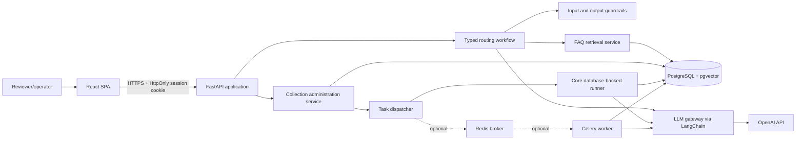
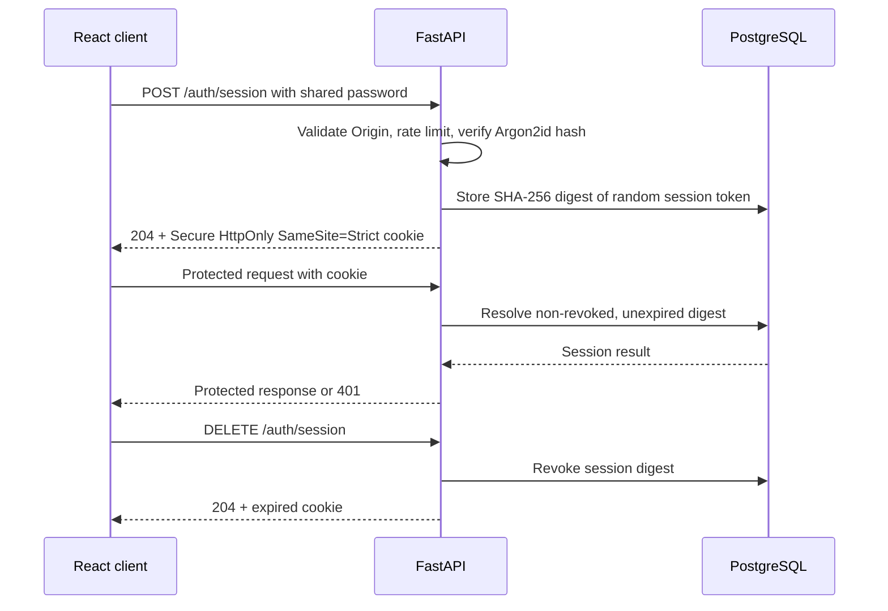
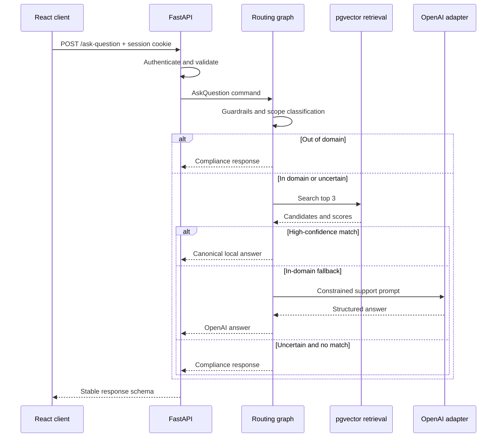
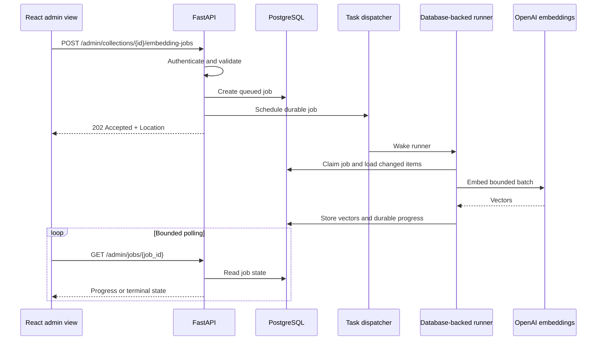

# Semantic FAQ Assistant Architecture

> Status: Accepted for implementation
> Requirements baseline: [requirements.md](requirements.md)
> Last updated: 2026-08-08

## 1. Purpose and Governance

This document defines the architecture and implementation boundaries for the Semantic FAQ Assistant. Once agreed, it is the source of truth for implementation decisions. The requirements document remains an immutable record of the challenge.

Any implementation change that conflicts with this document must first be reflected here. Implementation plans, tickets, and code should derive from the accepted version of this architecture.

## 2. Goals

- Answer supplied account-support FAQ questions locally when retrieval confidence is high.
- Fall back to an OpenAI model for in-domain questions without a sufficiently strong local match.
- Refuse out-of-domain questions through a compliance route with the required fixed response.
- Keep routing explicit, extensible, observable, and testable rather than hiding decisions in one prompt.
- Preserve source FAQ data while supporting normalization, metadata, incremental embedding updates, and multiple collections.
- Expose a robust, authenticated FastAPI service with stable contracts and graceful dependency failures.
- Provide a minimal React client for asking questions and administering FAQ collections.
- Run locally through Docker Compose with a production-like core profile.
- Keep Celery/Redis and live Azure deployment as time-boxed extensions that do not block a complete core submission.
- Demonstrate automated CI, a documented Git strategy, and an optional secure Azure CD path.
- Measure retrieval, routing, answer quality, safety, latency, and cost.

## 3. Non-Goals

- A general-purpose conversational assistant or persistent chat history.
- A full-featured customer portal or general-purpose content-management system. The React client is intentionally limited to the FAQ workflow and collection administration.
- User registration, usernames, password recovery, social login, roles, or multi-tenant authorization. One shared password and opaque browser sessions are an accepted challenge/demo constraint.
- Autonomous tools that can mutate accounts or external systems.
- Training or fine-tuning an embedding or language model.
- Distributed microservices. The challenge does not justify their operational overhead.

## 4. Architectural Style

The system is a **modular monolith** with ports and adapters:

- **React** provides a thin browser interface for question answering, FAQ administration, and embedding-job status.
- **FastAPI** owns HTTP transport, validation, authentication, and dependency wiring.
- **Application services** own the question-answering use case and typed routing state.
- **Domain policies** own guardrail, scope, retrieval-confidence, and route decisions.
- **Adapters** isolate PostgreSQL/pgvector, OpenAI, LangChain, task dispatch, and configuration.
- **A core database-backed runner** processes durable embedding jobs outside the originating HTTP request.
- **An optional Celery worker** can replace the core dispatcher through the same port, using Redis only as its broker.

The React client contains presentation and HTTP state only; all validation, authorization, collection lifecycle, routing, and embedding decisions remain server-side. This shape keeps the submission understandable while allowing models, providers, vector stores, and routing policies to be replaced independently.

## 5. System Context



## 6. Runtime Components

### 6.1 API Layer

FastAPI provides:

- `POST /ask-question` for the challenge use case.
- `/admin/collections`, `/admin/items`, and `/admin/jobs` resources for knowledge-base administration.
- `GET /health/live` for process liveness.
- `GET /health/ready` for database and required configuration readiness.
- `POST /auth/session`, `GET /auth/session`, and `DELETE /auth/session` for login, session status, and logout.
- Pydantic request, response, and error models.
- Opaque cookie-session authentication through `Depends(get_session)` on every application and administration endpoint.
- Request IDs, structured logging, exception translation, and OpenAPI documentation.

Health endpoints expose no sensitive details and may remain unauthenticated for platform probes. The API layer does not contain routing, retrieval, collection-lifecycle, or provider logic.

### 6.2 React Web Client

A minimal TypeScript React single-page application provides two focused views:

- **Login:** accept the shared password and establish a server-managed browser session.
- **Ask:** submit a question and display the answer source, matched question when present, answer, loading state, and safe failure state.
- **Administration:** list collections and items, add or edit FAQ content, import a batch, start an embedding job, inspect progress and failures, and activate a ready collection.

The client submits the shared password once over HTTPS to create a session. FastAPI returns an opaque token only in a `Secure`, `HttpOnly`, `SameSite=Strict` cookie with an absolute seven-day lifetime. Browser requests use `credentials: include`; JavaScript cannot read the token. Neither the password nor session token is compiled into frontend assets, persisted to Web Storage, placed in a URL, or written to browser logs.

Every valid session grants access to both question-answering and administration endpoints. This intentionally satisfies challenge-level authentication but does **not** provide user identity, role separation, revocation per user, or an audit trail of individual actors. It must be documented as a demo limitation and replaced by OIDC/OAuth2 before supporting untrusted users.

In the live budget deployment, FastAPI serves the compiled React assets from the same origin. Local development may use the Vite development server with an explicit CORS allowlist that permits credentials.

### 6.3 Question-Answering Workflow

The use case is represented as a typed state graph using LangGraph, which is part of the LangChain ecosystem. Nodes are small application services and conditional edges are explicit policies. The graph is agentic in orchestration but deterministic wherever an LLM is unnecessary.

Workflow nodes:

1. **Validate and normalize** the question without changing its meaning.
2. **Apply input guardrails** and reject exploitative or malformed input.
3. **Classify scope** as in-domain, out-of-domain, or uncertain.
4. **Retrieve candidates** from pgvector for in-domain or uncertain input.
5. **Evaluate confidence** using retrieval evidence and configured policy.
6. **Select a route**: local answer, OpenAI fallback, compliance response, or dependency error.
7. **Compose and validate output** against the response schema and output guardrails.

The graph state records only typed internal data such as normalized input, guardrail result, scope decision, candidates, scores, selected route, answer, and diagnostic metadata. It never exposes chain-of-thought.

### 6.4 Embedding Service

An `EmbeddingProvider` port accepts batches of texts and returns vectors plus model metadata. The initial adapter uses LangChain's OpenAI embeddings integration with `text-embedding-3-small`.

The embedding model and dimensions are configuration and collection metadata, not assumptions spread through the code. A collection cannot mix embeddings from different models or dimensions.

`text-embedding-3-small` is the proposed default because this is a small corpus and the lower cost and latency are preferable. The adapter can switch to `text-embedding-3-large` without changing application logic, but doing so requires a new collection or full re-embedding.

### 6.5 Retrieval Service

The initial retrieval algorithm is cosine similarity over normalized FAQ questions:

1. Embed the normalized user question.
2. Query the active collection for the top three nearest questions.
3. Return raw cosine scores and FAQ metadata.
4. Let the confidence policy decide whether the best candidate is safe to use.

The original question and answer are preserved verbatim. A separate normalized question is used for embedding and search. Category, collection, source hash, model, and timestamps are stored as metadata; category is not used as a hard filter because it is not known reliably at query time.

The retrieval interface permits future hybrid search or reranking, but neither is part of the initial implementation without evaluation evidence that cosine search is insufficient.

### 6.6 Confidence Policy and Semantic Router

The router is a composable policy, not a single hard-coded `if score > threshold` statement. It considers:

- the top cosine-similarity score;
- the margin between the first and second candidates;
- input and candidate quality signals;
- scope-classification confidence;
- configured model and collection versions.

Routing outcomes:

| Condition                                      | Route                   |
| ---------------------------------------------- | ----------------------- |
| Unsafe or exploitative input                   | Guardrail refusal/error |
| Clearly out of general technical-support scope | Compliance response     |
| In scope and high-confidence FAQ match         | Local answer            |
| In scope and no high-confidence FAQ match      | OpenAI fallback         |
| Uncertain scope with convincing FAQ match      | Local answer            |
| Uncertain scope without convincing FAQ match   | Compliance response     |
| Required dependency unavailable                | Stable service error    |

Thresholds and score margins are environment configuration calibrated from an evaluation dataset. They must not be selected only by intuition. A conservative provisional value may be used during development, but it is not accepted as final until the evaluation report is produced.

The scope boundary is **general technical support**: account support plus software, hardware, networking, devices, security, and developer-tool troubleshooting. Programming, architecture, AI theory, general technology commentary, and non-technical topics are outside scope unless they directly diagnose or resolve a support problem. This taxonomy is versioned with boundary examples. OpenAI handles unmatched questions inside this support domain, while out-of-domain questions receive the fixed compliance answer.

### 6.7 Answer Composition

For a high-confidence local match, the system returns the canonical stored answer verbatim and reports the matched canonical question. This avoids hallucination, preserves the knowledge base as authority, and consumes no additional OpenAI request.

For an in-domain fallback, the `ChatProvider` port calls an allowed OpenAI chat model through LangChain. The proposed default is `gpt-5.4-mini`. The prompt:

- identifies the general technical-support role and its explicit boundaries;
- treats user input as untrusted data, not instructions;
- prohibits claims of account access or completed actions;
- requests a concise answer;
- requires structured output that is validated before use.

The provider has explicit timeout, limited retry with backoff, rate-limit handling, and malformed-output handling. Provider errors are never returned verbatim to clients.

The compliance route is deterministic and returns exactly:

> This is not really what I was trained for, therefore I cannot answer. Try again.

### 6.8 Knowledge Base and Persistence

PostgreSQL with the pgvector extension is the canonical store.

Core tables:

**`faq_collections`**

- `id`, `name`, `version`, `status`
- `embedding_model`, `embedding_dimensions`
- `created_at`, `updated_at`

**`faq_items`**

- `id`, `collection_id`
- `question_raw`, `question_normalized`, `answer_raw`, `category`
- `content_hash`, `source_metadata`
- `embedding`, `embedding_model`
- `is_active`, `created_at`, `updated_at`, `embedded_at`

**`embedding_jobs`**

- `id`, `collection_id`, `status`
- `requested_count`, `processed_count`, `failed_count`
- `error_summary`, `created_at`, `started_at`, `completed_at`

**`auth_sessions`**

- `id`, `token_digest`, `expires_at`
- `created_at`, `revoked_at`, `last_seen_at`

The raw session token is generated with at least 256 bits of cryptographic randomness and is never stored server-side. PostgreSQL stores only its SHA-256 digest. Sessions have an absolute seven-day expiry, do not slide on activity, and can be revoked individually through logout or collectively by an operational command.

PostgreSQL is authoritative for job state. The core runner claims jobs directly from PostgreSQL. When the optional Celery adapter is enabled, Redis transports task identifiers but is not the result backend.

Important constraints:

- Unique `(collection_id, content_hash)` prevents duplicate ingestion.
- Vector dimensions must match the parent collection.
- Existing records are updated or deactivated explicitly, never deleted as an incidental effect of import.
- An item is searchable only when its embedding matches its current content hash and collection model.
- An HNSW cosine index supports vector search.
- Database migrations are managed through Alembic.

### 6.9 Collection and Embedding Management

The authenticated administration API is the primary management interface:

| Method and path                                  | Behavior                                          |
| ------------------------------------------------ | ------------------------------------------------- |
| `GET /admin/collections`                         | List collections and readiness summaries          |
| `POST /admin/collections`                        | Create a collection with embedding-model metadata |
| `GET /admin/collections/{id}/items`              | List FAQ items and embedding state                |
| `POST /admin/collections/{id}/items`             | Validate and bulk upsert FAQ items                |
| `PATCH /admin/collections/{id}/items/{item_id}`  | Update one FAQ item using optimistic concurrency  |
| `DELETE /admin/collections/{id}/items/{item_id}` | Soft-deactivate one FAQ item                      |
| `POST /admin/collections/{id}/embedding-jobs`    | Queue embeddings for new or changed content       |
| `GET /admin/jobs/{job_id}`                       | Return durable progress and safe failure details  |
| `POST /admin/collections/{id}/activate`          | Atomically activate a fully ready collection      |

Starting an embedding job writes a durable `queued` record in PostgreSQL, asks the configured `TaskDispatcher` to schedule it after the response, and returns `202 Accepted` with a `Location` header pointing to the job resource. The core dispatcher wakes a database-backed runner; process loss leaves the durable record available for startup/periodic reconciliation. The React dashboard polls the job resource with bounded backoff.

The importer computes a stable content hash from canonical source fields. Unchanged records retain their existing embeddings; only new or changed records consume embedding tokens. Imports do not delete records absent from a later source file.

The core runner claims and updates PostgreSQL job records, is idempotent by job and content hash, retries transient provider failures with bounded exponential backoff, and records terminal failures. The API never computes embeddings inside an HTTP request. The time-boxed Celery extension replaces only the dispatcher/runner adapter, uses Redis solely as broker, and preserves the same durable state, reconciliation, and HTTP contracts.

Non-HTTP commands remain only for Alembic migrations, initial operational bootstrap, and recovery when the API is unavailable. They reuse application services where applicable and do not form a second day-to-day management interface.

### 6.10 Guardrails

Guardrails are layered because no single classifier is sufficient:

- **Transport validation:** JSON schema, required field, string type, maximum length, and request-size limit.
- **Normalization:** Unicode normalization and whitespace cleanup while preserving the raw input for audit-safe diagnostics.
- **Input policy:** detect prompt-injection patterns, attempts to reveal system instructions or secrets, encoded payload abuse, and unsupported content.
- **Least privilege:** the runtime LLM has no tools, credentials, database access, or ability to perform account actions.
- **Prompt isolation:** system policy and user data are passed in separate messages; retrieved text is also treated as untrusted data.
- **Structured output:** provider responses are parsed into a strict model with length and content checks.
- **Output policy:** block leaked secrets, hidden prompts, unsupported action claims, and malformed content.
- **Authentication policy:** verify the shared password against an Argon2id hash, return generic login failures, apply a configurable in-process token bucket per source IP in the fixed one-replica demo, and never log password or session values. A scaled production design would move throttling to a shared edge or gateway.
- **Cookie policy:** set only `Secure`, `HttpOnly`, `SameSite=Strict`, `Path=/` session cookies outside local development; use an absolute seven-day expiry.
- **CSRF policy:** validate `Origin` on login and every state-changing request in addition to `SameSite=Strict`; allow only the configured same origin or local Vite origin.
- **Session policy:** reject expired or revoked sessions, rotate by creating a new random token at each login, revoke on logout, and prune expired rows opportunistically during login plus an operational cleanup command.
- **Logging policy:** do not log passwords, session tokens, API keys, complete prompts, or raw potentially sensitive questions by default.

Guardrail outcomes and reasons are represented by internal enums and metrics, not improvised strings.

### 6.11 Provider Abstractions

Application code depends on these ports:

- `EmbeddingProvider`
- `ChatProvider`
- `FAQRepository`
- `CollectionRepository`
- `EmbeddingJobRepository`
- `SessionRepository`
- `QuestionGuardrail`
- `ScopeClassifier`
- `RoutingPolicy`
- `TaskDispatcher`

OpenAI/LangChain, pgvector, the core runner, and optional Celery are adapters behind these interfaces. Tests use deterministic fakes. Provider selection occurs in the composition root through typed settings and dependency injection.

## 7. Request Flows

### 7.1 Authentication



### 7.2 Question Answering



### 7.3 Embedding Administration



## 8. API Contract

Create a session:

```http
POST /auth/session
Content-Type: application/json
```

```json
{
  "password": "<shared-password>"
}
```

```http
HTTP/1.1 204 No Content
Set-Cookie: faq_session=<opaque-token>; Path=/; Max-Age=604800; Secure; HttpOnly; SameSite=Strict
```

The cookie authenticates every subsequent non-health request. `GET /auth/session` returns `204` for an active session and `401` otherwise. `DELETE /auth/session` revokes the current session, expires the cookie, and returns `204`; it remains idempotent when the session is already absent.

Question request:

```json
{
  "user_question": "How do I reset my account?"
}
```

Successful response:

```json
{
  "source": "local",
  "matched_question": "How can I restore my account to its default settings?",
  "answer": "In the account settings, there should be an option labeled 'Restore Default'. Clicking this will revert all custom settings back to their original state."
}
```

Embedding-job response:

```http
HTTP/1.1 202 Accepted
Location: /admin/jobs/01JEXAMPLE
```

```json
{
  "job_id": "01JEXAMPLE",
  "status": "queued"
}
```

`source` is one of `local`, `openai`, or `compliance`. `matched_question` is the canonical question for local responses and `null` otherwise. Job status is one of `queued`, `running`, `completed`, `partially_failed`, or `failed`. The API exposes a request ID through a response header, but internal scores, prompts, and policy reasons are not part of public responses.

Errors use one stable envelope containing a machine-readable code, safe message, and request ID. Expected mappings include:

- `400` malformed JSON;
- `401` incorrect shared password or missing, expired, or revoked session, always using a generic message;
- `404` unknown administration resource;
- `409` stale update, incompatible collection state, or activation conflict;
- `422` request-schema violation;
- `429` application or provider rate limit;
- `502` malformed upstream response;
- `503` database, dispatcher, or provider temporarily unavailable;
- `504` upstream timeout.

## 9. Configuration and Secrets

Pydantic Settings loads environment configuration with startup validation. Core configuration includes the database URL, shared-password Argon2id hash, session-cookie settings, OpenAI key, embedding and chat models, collection name, thresholds, timeouts, retry limits, input limits, allowed origins, and logging level. The optional async profile adds Redis and Celery settings.

The operator generates one high-entropy shared password, distributes it to reviewers out of band, and provisions only its Argon2id hash to the backend. The cleartext password is never stored by the application. Session tokens are separate random credentials generated after successful verification; only their SHA-256 digests are persisted.

Secrets are supplied only through local environment variables or Azure Container Apps secrets. `.env.example` contains placeholders; `.env` is ignored. Frontend build-time variables contain no secrets. `SESSION_COOKIE_SECURE=false` is permitted only in local HTTP development; deployed environments fail startup unless secure cookies are enabled. The challenge key present in the immutable requirements must not be copied into code, browser assets, images, tests, logs, or committed runtime configuration.

## 10. Deployment Topology

### 10.1 Local Development

Docker Compose runs:

- `api`: FastAPI under an ASGI server, serving the production React build;
- `frontend`: an optional development profile running Vite with hot reload;
- `runner`: the core database-backed embedding-job runner from the same application image;
- `postgres`: a pinned PostgreSQL image with pgvector;
- an optional one-shot `migrate` profile for Alembic and operational bootstrap.
- an optional `async` profile containing a Celery worker and pinned Redis broker in place of the core runner.

A multi-stage Dockerfile builds the React application, installs pinned Python dependencies, and creates a non-root, health-checked runtime image. The API and job runner use the same immutable image with different commands. PostgreSQL and optional Redis use health checks and named volumes. Service startup waits for readiness through Compose conditions and application retries rather than fixed sleeps.

### 10.2 Time-Boxed Azure Extension

After the complete core submission passes its acceptance gate, a live demonstration environment may be provisioned with Bicep within the remaining time budget:

- **Azure Container Registry Basic** stores commit-addressed application images.
- **Azure Container Apps Environment** hosts one fixed-size Container App revision with three co-located containers:
  - `api` serves the compiled React application and FastAPI API through external HTTPS ingress;
  - `worker` runs Celery from the same application image;
  - `redis` is an internal, pinned broker sidecar with no external ingress.
- **Azure Database for PostgreSQL Flexible Server** stores relational data, pgvector embeddings, and durable embedding-job state.
- **Azure Monitor and Log Analytics** receive platform and structured application logs.
- **A one-shot Container Apps Job** runs Alembic migrations from the application image during deployment.

The Container App uses a managed identity to pull from ACR. Runtime secrets are stored in Container Apps secret configuration and projected only into the containers that require them. PostgreSQL uses encrypted transport and firewall/network restrictions appropriate to the selected Container Apps environment.

The Container App has one minimum and one maximum replica so the worker and Redis sidecar share a stable local network. Redis data is intentionally ephemeral in this budget topology; PostgreSQL job records and the reconciler recover stale queued work after a revision or broker restart.

This topology is a **live demonstration compromise**, not a production high-availability design. API, worker, and broker cannot scale independently, a revision restart interrupts queued transport, and one replica is a single availability unit. A production evolution would separate the API and worker into independently scaled Container Apps and replace the sidecar with Azure Managed Redis or another durable broker.

This extension is not a blocker for the core acceptance criteria. If time expires, the repository retains validated Bicep and a documented deployment path without claiming that a live environment was delivered.

### 10.3 Git and CI/CD Strategy

The repository uses trunk-based development:

- `main` is protected and always releasable;
- work happens on short-lived feature branches through pull requests;
- required reviews and CI checks block merges;
- releases use immutable commit-SHA image tags rather than long-lived environment branches.

Pull-request CI runs backend formatting, linting, typing, unit and contract tests; frontend formatting, linting, type checking, component tests, and production build; dependency and secret scanning; and Docker Compose integration tests where practical. Bicep validation is added with the Azure extension.

Core delivery builds and tests immutable commit-SHA images. In the Azure extension, a merge to `main` may authenticate through workload identity federation/OIDC, push the image to ACR, apply reviewed Bicep changes, run the migration job, update the Container App revision, and perform authenticated smoke tests. No Azure publish profile or long-lived service-principal secret is stored in GitHub. A protected GitHub Environment provides the production approval and audit boundary. Rollback selects the previous healthy Container App revision and image; database migrations must therefore be backward compatible across one application revision.

## 11. Observability

- JSON logs include timestamp, level, request ID, route, latency, collection/model versions, and safe error codes.
- Metrics cover request count, latency, route distribution, similarity-score distribution, guardrail outcomes, provider errors, token usage, embedding-job results, and estimated OpenAI cost.
- Azure Container Apps and PostgreSQL platform signals flow to Azure Monitor/Log Analytics; alerts cover unhealthy revisions, repeated job failures, dependency errors, and abnormal fallback rates.
- Authentication metrics include success/failure counts, throttled attempts, active sessions, and revocations without recording credentials or source passwords.
- The React client displays request IDs for support but never sends credentials, cookies, or raw questions to client-side telemetry.
- Raw questions and answers are excluded from normal logs. A local debug mode may log redacted samples explicitly.
- Readiness fails when the active collection is absent or incompatible with configured embedding dimensions.

## 12. Quality and Evaluation

Evaluation uses a versioned dataset containing FAQ paraphrases, near-neighbor ambiguities, in-domain questions without local answers, out-of-domain questions, malformed inputs, and prompt-injection attempts. It is separate from the 33 source FAQ records to avoid testing only memorization.

Objective measures:

- retrieval Recall@1 and Recall@3;
- mean reciprocal rank;
- local-route precision and recall;
- false-local-answer rate, treated as a high-cost error;
- in-domain/out-of-domain classification accuracy and F1;
- guardrail attack-block rate and benign false-positive rate;
- schema-valid response rate;
- p50/p95 latency, token usage, and cost by route;
- availability and dependency-failure behavior.

Threshold selection uses a precision-recall curve and prioritizes local-route precision over local-route recall. A weak local match is worse than a controlled fallback.

Subjective review scores fallback answers for relevance, correctness, clarity, safety, unsupported claims, and consistency with the support scope. At least two reviewers should assess a small blinded sample when practical. Evaluation artifacts record dataset version, model versions, prompts, thresholds, date, and results so regressions are reproducible.

### 12.1 Calibrated Operating Point

The `support-routing-v1` dataset contains 25 prompts separate from the canonical 33 FAQ questions. Its deterministic CI observation set, `support-routing-v1-deterministic-v1`, evaluates 130 similarity-threshold and margin combinations through the production routing policy. The accepted defaults are a `0.84` similarity threshold, `0.08` similarity margin, and `0.75` scope-confidence threshold.

At that operating point the recorded dataset has retrieval Recall@1 of `0.818182`, Recall@3 of `1.0`, MRR of `0.909091`, local-route precision and recall of `1.0`, zero false-local answers, scope accuracy/F1 of `1.0`, complete attack blocking, zero benign guardrail false positives, and a schema-valid rate of `1.0`. The recorded fallback sample contains 18 reviews across nine answers, with mean correctness `4.333333/5` and no marked unsupported claims.

Known boundary cases are the phishing and notification FAQ paraphrases, the Wi-Fi fallback, and the three near-neighbor ambiguity prompts. These cases remain in the regression set. The versioned baseline and generated JSON/Markdown reports live under `backend/evaluation/`; `make evaluation` must reproduce and verify them.

This evidence is deterministic, not a live OpenAI or production-latency benchmark. Recorded token counts are suitable for regression comparisons, while zero cost means the deterministic provider made no billable request and is not a pricing estimate. Approved live-model observations should replace this observation set before production retuning without changing the report schema or metric implementation.

## 13. Testing Strategy

- **Unit tests:** normalization, hashes, confidence policy, guardrail decisions, route edges, response mapping, and incremental-update logic.
- **Retrieval tests:** known paraphrases and confusing pairs against pgvector.
- **Contract tests:** FastAPI validation, shared-password login, cookie flags, session status/logout, authentication dependencies, CSRF origin checks, administration concurrency, asynchronous `202` responses, response schemas, and safe errors.
- **Adapter tests:** mocked OpenAI responses including timeout, rate limit, malformed output, and refusal.
- **Integration tests:** PostgreSQL/pgvector migrations, indexing, import, search, session digest persistence/expiry/revocation, durable job transitions, runner restart reconciliation, and task idempotency. The async extension adds Redis publication-failure and Celery-adapter tests.
- **Frontend tests:** React component tests for login, session restoration, logout, asking, editing, job polling, loading, empty, and failure states; tests assert that no credentials enter Web Storage.
- **End-to-end tests:** Playwright against Docker Compose for login persistence, seven-day cookie configuration, logout, local/OpenAI-fake/compliance answers, FAQ administration, embedding jobs, and dependency-failure paths.
- **Infrastructure tests:** core container health checks; the Azure extension adds Bicep lint/validation and post-deployment authenticated smoke tests.
- **Evaluation tests:** versioned quality suite that reports metrics separately from deterministic CI pass/fail tests.

Formatting, linting, static typing, security checks, and tests run in CI. Proposed tooling is Ruff, mypy, pytest, and coverage reporting for Python; ESLint, TypeScript, Vitest, React Testing Library, and Playwright for the client.

## 14. Proposed Module Boundaries

```text
backend/
  src/
    api/               # FastAPI auth/question/admin routes, dependencies, schemas
    application/       # auth, question, collection, job use cases and routing graph
    domain/            # entities and auth/routing/guardrail/lifecycle policies
    ports/             # provider, repository, and dispatcher protocols
    adapters/
      db/              # SQLAlchemy and pgvector repositories
      llm/             # LangChain OpenAI adapters
      tasks/           # core runner, reconciliation, and optional Celery adapter
    ops/               # migrations, bootstrap, and recovery commands only
    core/              # settings, logging, composition root
  migrations/          # Alembic revisions
frontend/
  src/                 # React ask and administration views
infra/
  bicep/               # budget Azure topology
.github/workflows/     # PR CI and Azure deployment
tests/
  unit/
  integration/
  contract/
  e2e/
  evaluation/
```

Backend dependencies point inward: API and adapters may depend on application/domain contracts; domain code does not import FastAPI, LangChain, SQLAlchemy, Celery, or OpenAI. The frontend depends only on the published HTTP contract and contains no backend domain rules.

## 15. Requirement Coverage

| Requirement                                         | Architectural coverage                                                                          |
| --------------------------------------------------- | ----------------------------------------------------------------------------------------------- |
| Embedding computation and searchable representation | Embedding provider, pgvector schema/index, management pipeline                                  |
| Similarity search                                   | Top-three cosine retrieval and calibrated confidence policy                                     |
| OpenAI through LangChain                            | Provider adapters and constrained fallback route                                                |
| FastAPI endpoint and Python practices               | Typed API layer, dependencies, stable errors, CI quality gates                                  |
| Agentic/extensible routing                          | Typed LangGraph workflow and composable policies                                                |
| Graceful malformed/bad/exploit handling             | Validation, provider error mapping, layered guardrails                                          |
| Authentication bonus                                | Shared-password login and opaque PostgreSQL-backed sessions validated by `Depends(get_session)` |
| PostgreSQL/pgvector bonus                           | Canonical persistence and vector search                                                         |
| Docker Compose bonus                                | API, runner, and PostgreSQL/pgvector core topology; optional Celery/Redis profile               |
| Incremental embedding scripts bonus                 | Authenticated administration REST resources plus hash-based idempotent jobs                     |
| Semantic/compliance router bonus                    | Scope classifier plus deterministic compliance route                                            |
| Prompt-injection guardrails bonus                   | Layered input, prompt, privilege, and output controls                                           |
| Dockerfile bonus                                    | Shared non-root application image                                                               |
| Celery bonus                                        | Time-boxed adapter for idempotent asynchronous embedding batches                                |
| Output-quality documentation                        | Versioned objective and subjective evaluation process                                           |
| Committed web-client scope                          | Minimal React ask/admin client consuming the documented REST API                                |
| Time-boxed cloud extension                          | Bicep, GitHub OIDC CD, ACR, Container Apps, PostgreSQL, and Azure Monitor                       |

## 16. Decision Record

### 16.1 Accepted Decisions

1. React question-answering and administration views, HTTP knowledge-base management, PostgreSQL/pgvector, guardrails, Docker Compose, and automated CI are committed implementation scope.
2. HTTP is the primary management interface; commands remain only for migrations, bootstrap, and operational recovery.
3. Authentication uses one shared password distributed out of band. Successful login creates a random opaque PostgreSQL-backed session in a `Secure`, `HttpOnly`, `SameSite=Strict` cookie with an absolute seven-day expiry. The design deliberately omits users, roles, JWTs, and refresh tokens and is not presented as production identity or authorization.
4. High-confidence local matches return canonical stored answers verbatim without another LLM call.
5. In-domain means general technical support: account support plus software, hardware, networking, devices, security, and developer-tool troubleshooting.
6. The initial providers are `text-embedding-3-small` and `gpt-5.4-mini`, isolated behind ports.
7. LangGraph implements the typed routing workflow.
8. Final similarity thresholds are calibrated from a labeled evaluation set, prioritizing local-route precision.
9. Durable PostgreSQL embedding jobs and the `TaskDispatcher` port are core. A database-backed runner preserves asynchronous `202` behavior without Redis.
10. Celery/Redis and live Azure deployment are time-boxed extensions after core acceptance. The Azure target remains the documented budget Container Apps compromise.
11. The repository uses protected-main, short-lived branches, pull-request CI, and immutable images. The Azure extension uses Bicep and GitHub OIDC.

### 16.2 Open Decisions

No architecture decision currently blocks implementation. New decisions discovered during delivery must be recorded here before they change a governing contract or boundary.
